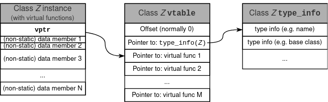

# Memory Layout Test

The objective of this small C++ console application is to develop a better understanding of how the vtable is built by the compiler and how is it linked in created objects.

Below I walk you trough the application's output to stdout. In case you want to check your compiler too, just build it with cmake. It also means that the numbers you will see in your output will differ from the ones I got in my execution, which was build with g++ version 11.2.0 on a 64-bit Ubuntu Linux system. 

Essentially all the examples are built around a trivial struct
```C++
struct
{
    int32_t a;
    int32_t b;
    int64_t c;
};
```
Four different variations of this structure are investiaged, involving also polymorphic variants.

## POD ("PlainOldData")

In the first variant, the introduced struct is instantiated. As expected, a pointer to the struct points to element `a`. In memory elements `b` and `c` follow after `a`. Trivially the size of the struct is 16 bytes. That's confirmed by the program (output):
```Shell
PlainOldData: (instance size=16bytes)
 &obj=0x7ffd81ac1e90
  &obj.a=0x7ffd81ac1e90 (+0bytes)
  &obj.b=0x7ffd81ac1e94 (+4bytes)
  &obj.c=0x7ffd81ac1e98 (+8bytes)
```

## Basic Class ("PlainClass")

Let's build a class out of the struct, introduce a constructor and destructor, make `b` a private member, and add public getters for `b` and `c`. Since the getter functions as well as the constructors and destructors are part of the text section of the program in memory, the size of the class still remains the same. Noteworthy maybe (I hope you already kew though): The members are located in memory according to the order of their declaration. Public/private doesn't matter:

```Shell
PlainClass: (instance size=16bytes)
 &obj=0x7ffd81ac1ea0
  &obj.a=0x7ffd81ac1ea0 (+0bytes)
  &obj.b=0x7ffd81ac1ea4 (+4bytes)
  &obj.c=0x7ffd81ac1ea8 (+8bytes)
```

## <a name="e3">Virtual Class Example ("VirtualChildClass")</a>

The same as in the previous section, but now the class is derived from some base class (which doesn't have any members, except two pure virtual getters for `b` and `c`). All statements apply again, as we don't do any runtime type resolution (yet). However, we observe that the size of the class in memory increased by 8 bytes. Namely, 8 bytes were squeezed just before the first data member:

```Shell
VirtualChildClass: (instance size=24bytes)
 &obj=0x7ffd81ac1ec0
  &obj.a=0x7ffd81ac1ec8 (+8bytes)
  &obj.b=0x7ffd81ac1ecc (+12bytes)
  &obj.c=0x7ffd81ac1ed0 (+16bytes)
```

The compiler introduced as the very first element in memory the `vptr` (or vPointer or Virtual Pointer). It's a pointer pointing to the instance's `vtable`.

## Polymorphic Example ("(VirtualBaseClass*)&VirtualChildClass")

Let's now cast a pointer to the above's `VirtualChildClass` to it's base class (`VirtualBaseClass`). The size of the `VirtualBaseClass` is just 8 bytes. That's natural, as we said, the base class doesn't consist of anything but the pure virtual getters. For better understanding the code for the base class:

```C++
class VirtualBaseClass
{
  public:
    virtual b_type const& get_b() const = 0;
    virtual c_type const& get_c() const = 0;
};
```

However, the instance we are looking at is actually a child of the base, and so, we can still check the addresses of members `a`, `b`, and `c`:

```Shell
(VirtualBaseClass*)&VirtualChildClass: (instance size=8bytes)
 &obj=0x5589d933f2c0
  &obj.a=? (private...)
  &obj.b=0x5589d933f2cc (+12bytes)
  &obj.c=0x5589d933f2d0 (+16bytes)
```

No surprise, the memory layout follows the child class (as already investigated  [above](#e3)).

## vptr and vtable

Ok, no surprises at all, let's discuss the core of it now. We know that the first element in memory of a virtual class instance is the `vptr`. It points to the class's `vtable`. In the `vtable` the CPU then finds pointers to the virtual function implementations, such that it can be bound dynamically. Additionally, from some sources on the Internet we can presume that the vtable also hosts some type information as well. Let's verify that.

### Addresses of Getter Functions and Type Info

As a first step, let's gather the child class's getter function addresses. Keep in mind: we're examining an instance of the child class. We just cast it later on to a base class. Additionally let's compute the address of the child class's type information:

```Shell
&VirtualChildClass::get_b()=0x5589d8f2f31c
&VirtualChildClass::get_c()=0x5589d8f2f332
&type_info=0x5589d8f32d00     (name=N12_GLOBAL__N_117VirtualChildClassE):
```

### Contents of the vtable
Now let's see what's in the memory location our `vptr` points to. To simplify the output, let's just assume that `vptr` points to `vtable[]`:

```Shell
  vtable[-2]=0x0
  vtable[-1]=0x5589d8f32d00   (=typeinfo(VirtualChildClass))
  vtable[0]=0x5589d8f2f31c   (=VirtualChildClass::get_b())
  vtable[1]=0x5589d8f2f332   (=VirtualChildClass::get_c())
```

Ok, that's interesting. The `vptr` points to the third entry in the `vtable` actually (the first entry should be the offset and =0 in our example). That's however, totally meaningful, as normally you don't want to access the type information but rather the virtual functions. So it's more efficient to let `vptr` point to the first virtual function, rather than the actual beginning of `vtable`. Note that this is compiler specific. My GCC has implemented it this way, your compiler might do it differently! And don't even mentino multiple inheritance....

Luckily, the compiler takes care of that all, and we dont' need to worry.

A summary is sketched below:



## Literature

For a good introduction I can highly recommend [Pablo Arias' "Understandig Virtual Tables in C++"](https://pabloariasal.github.io/2017/06/10/understanding-virtual-tables/). Also noteworthy: [Shahar Mike's "C++ vtables"](https://shaharmike.com/cpp/vtable-part1/).